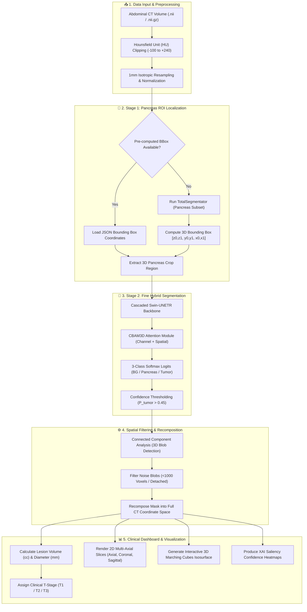

# 🧠 PanT-HybridNet: Automated Pancreatic Tumor Detection & Clinical Staging

[](https://www.python.org/)
[](https://pytorch.org/)
[](https://monai.io/)
[](https://streamlit.io/)
[-00D4FF?style=for-the-badge)](https://neurips.cc/)
[](LICENSE)

**PanT-HybridNet** is a state-of-the-art deep learning prototype for automated 3D pancreatic tumor detection, precision volumetric segmentation, and clinical T-staging from abdominal CT scans. Built upon the **PanTS Dataset (NeurIPS 2025)** benchmark, it combines a **Two-Stage Cascade Architecture** with a **3D Swin Transformer (Swin-UNETR)** and **3D Convolutional Block Attention Module (CBAM3D)** to conquer extreme organ-to-tumor class imbalance.

---

## 📋 Table of Contents

- [Overview](#-overview)
- [Key Features](#-key-features)
- [System Architecture & Flowchart](#-system-architecture--flowchart)
- [Technologies Used](#-technologies-used)
- [Repository Structure](#-repository-structure)
- [Dataset Information](#-dataset-information)
- [Installation Guide](#-installation-guide)
- [Requirements](#-requirements)
- [Usage Instructions](#-usage-instructions)
- [Model & Workflow Explanation](#-model--workflow-explanation)
- [Results & Clinical Findings](#-results--clinical-findings)
- [Future Improvements](#-future-improvements)
- [License](#-license)
- [Author](#-author)

---

## 🔬 Overview

Pancreatic Ductal Adenocarcinoma (PDAC) is one of the deadliest cancers due to late diagnosis and subtle initial signs on abdominal CT scans. Early-stage pancreatic tumors often occupy less than **0.5% of total CT volume**, creating severe class imbalance and boundary delineation challenges for standard 3D CNNs.

**PanT-HybridNet** solves this problem through a robust **two-stage cascade design**:
1. **Stage 1 (Coarse Bounding Box Localization):** Isolates the pancreas Region of Interest (ROI) using TotalSegmentator or pre-computed bounding coordinates, removing >95% of irrelevant background anatomy.
2. **Stage 2 (Fine Hybrid Segmentation):** Runs a **Cascaded Swin-UNETR + CBAM3D** model exclusively on the cropped organ volume, boosting tumor volume representation to ~15% of input voxels.
3. **Clinical T-Staging & XAI:** Computes lesion volume ($cc$) and estimated diameter ($mm$) to assign clinical stage ($T1$, $T2$, $T3$), while generating confidence heatmaps via Explainable AI (XAI).

---

## ✨ Key Features

- **🌐 Hybrid 3D Architecture:** Merges Swin Transformer self-attention (global context) with 3D CBAM spatial and channel attention (sharp boundary delineation).
- **🎯 Two-Stage Cascade Pipeline:** Organ localization followed by focal tumor segmentation to eliminate background noise.
- **🖼️ Multi-Axial 2D Slice Rendering:** View axial ($Z$), coronal ($Y$), and sagittal ($X$) slice projections with color-coded overlay masks.
- **🧊 Interactive 3D Mesh Rendering:** Full 3D volumetric isosurface extraction powered by Plotly and Marching Cubes (`skimage.measure`).
- **📊 Automated Clinical T-Staging:** Calculates maximum tumor diameter and assigns $T1$ ($<2\text{ cm}$), $T2$ ($2\text{--}4\text{ cm}$), or $T3$ ($>4\text{ cm}$) tumor stage.
- **🔥 Saliency & XAI Heatmaps:** Displays confidence attention maps highlighting regions driving model predictions.
- **🏥 Demo Patient Integration:** Built-in fast loading for demo cases and support for custom `.nii` / `.nii.gz` NIfTI volumes.
- **💻 Sleek Dark Mode Web UI:** Modern glassmorphism dashboard built with Streamlit and CSS animations.

---

## 📐 System Architecture & Flowchart

The following Mermaid diagram outlines the complete end-to-end workflow of the PanT-HybridNet project, from initial CT scan input to clinical reporting:



---

## 🛠️ Technologies Used

| Category | Technology | Usage |
| :--- | :--- | :--- |
| **Language** | Python 3.10+ | Core programming language |
| **Deep Learning** | PyTorch 2.0+ | Model definition, autograd, and GPU execution |
| **Medical AI** | MONAI 1.3+ | SwinUNETR architecture, sliding-window inference |
| **Organ Localization**| TotalSegmentator | Automated Stage 1 pancreas ROI detection |
| **Medical Imaging** | NiBabel, SciPy | NIfTI file parsing, 3D connected components, filters |
| **Mesh Processing** | Scikit-Image | Marching Cubes algorithm for 3D isosurface generation |
| **Web Dashboard** | Streamlit | Clinical frontend web application |
| **Visualization** | Plotly, Matplotlib | Interactive 3D rendering and 2D multi-axial slice plots |
| **Data Analysis** | Pandas, OpenPyXL | Dataset metadata analytics (`metadata.xlsx`) |

---

## 📁 Repository Structure

```
pancreatic_tumor/
├── notebooks/                                # Jupyter notebooks for exploration & training
│   ├── 01_PanTS_Data_Exploration.ipynb       # Notebook 1: Dataset downloading, analysis & metadata
│   ├── 02_Stage1_Pancreas_Cascade_Cropping.ipynb # Notebook 2: Stage 1 coarse ROI crop extraction
│   └── 03_Stage2_HybridNet_Model_Training.ipynb # Notebook 3: Stage 2 Swin-UNETR + CBAM3D training
├── app.py                                    # Streamlit web application frontend
├── cascade_best.pth.zip                      # Trained PyTorch checkpoint (Swin-UNETR + CBAM3D)
├── metadata.xlsx                             # Clinical metadata for 9,901 PanTS patient scans
├── requirements.txt                          # Project dependency list
├── .gitignore                                # Git ignore rules
└── README.md                                 # Project documentation
```

---

## 📊 Dataset Information

The project utilizes the **PanTS Dataset (NeurIPS 2025)**, a large-scale benchmark for pancreatic CT segmentation:

- **Total Scans:** 9,901 patient CT volumes in the full dataset (PanTSMini subset used for prototype development).
- **Classes Annotated:** 28 abdominal structures, focused in this project into a **3-class segmentation task**:
  - `Class 0`: Background
  - `Class 1`: Healthy Pancreas Tissue
  - `Class 2`: Pancreatic Lesion / Tumor (PDAC)
- **Metadata Features (`metadata.xlsx`):** Includes patient age, sex, scanner manufacturer, slice spacing, CT contrast phase (venous/arterial), tumor presence indicators, and structured radiological findings.

---

## 💻 Installation Guide

### Prerequisites

- **Python 3.10+** installed on your system.
- **Git** installed.
- (Optional but recommended) **NVIDIA GPU with CUDA** support for faster 3D inference.

### Step-by-Step Setup

1. **Clone the Repository:**
   ```bash
   git clone https://github.com/basitsocial-sys/pancreatic_tumor_detection.git
   cd pancreatic_tumor_detection
   ```

2. **Create a Virtual Environment:**
   - **Windows:**
     ```bash
     python -m venv venv
     .\venv\Scripts\activate
     ```
   - **Linux / macOS:**
     ```bash
     python3 -m venv venv
     source venv/bin/activate
     ```

3. **Install Dependencies:**
   ```bash
   pip install -r requirements.txt
   ```

---

## ⚙️ Requirements

The required Python dependencies listed in `requirements.txt`:

```txt
streamlit>=1.32.0
torch>=2.0.0
monai>=1.3.0
nibabel>=5.0.0
numpy>=1.24.0
matplotlib>=3.7.0
plotly>=5.18.0
scipy>=1.11.0
Pillow>=10.0.0
pandas>=2.0.0
openpyxl>=3.1.0
scikit-image>=0.21.0
```

---

## 🚀 Usage Instructions

### Running the Web Dashboard

Launch the clinical interactive interface locally:

```bash
streamlit run app.py
```

After executing the command, open your browser and navigate to `http://localhost:8501`.

### Operating the Dashboard

1. **Model Auto-Detection:** The app automatically loads the pre-trained model weights (`cascade_best.pth.zip`).
2. **Input CT Scan:**
   - **Option A:** Upload your own 3D abdominal CT scan (`.nii` or `.nii.gz` format) via the drag-and-drop file uploader.
   - **Option B:** Select a pre-loaded demo patient scan from the sidebar menu.
3. **Visualization & Analytics:**
   - Toggle between **2D Slice View** (Axial/Coronal/Sagittal), **3D Interactive Mesh**, and **XAI Heatmap**.
   - Adjust overlay opacity sliders and inspect calculated lesion volume ($cc$) and $T$-stage.

### Executing Notebooks

To re-run data preparation or model training notebooks:
```bash
jupyter notebook notebooks/
```

1. Open `01_PanTS_Data_Exploration.ipynb` for dataset inspection.
2. Open `02_Stage1_Pancreas_Cascade_Cropping.ipynb` for Stage 1 ROI crop generation.
3. Open `03_Stage2_HybridNet_Model_Training.ipynb` for model training execution.

---

## 🧠 Model & Workflow Explanation

### Model Architecture

```
Input (3D CT Crop) ──> [ SwinUNETR Backbone ] ──> [ CBAM3D Attention ] ──> Logits (3 Classes)
                             │                          │
                      Global Context            Spatial + Channel Focus
```

- **SwinUNETR:** Operates as a hierarchical 3D Swin Transformer encoder connected via residual skip connections to a 3D U-Net decoder. It computes self-attention across shifted 3D windows.
- **CBAM3D Module:** Applied at the output features to refine boundaries:
  - *Channel Attention:* Recovers class-specific features using adaptive average & max pooling.
  - *Spatial Attention:* Highlights spatial boundaries of pancreatic lesions using 3D spatial convolutions.
- **Loss Function:** Combined **Dice Loss + Weighted Cross-Entropy** (Weights: Background=0.1, Pancreas=2.0, Tumor=8.0) to penalize missed small tumors.
- **Optimization:** AdamW optimizer with Cosine Annealing learning rate schedule.

---

## 📈 Results & Output

The framework produces real-time diagnostic outputs:

| Output Metric | Description | Example |
| :--- | :--- | :--- |
| **Detection Result** | Binary classification derived from filtered connected components | `🔴 TUMOUR DETECTED` |
| **Pancreas Volume** | Total voxel count of healthy pancreatic parenchyma | `28,450 Voxels` |
| **Tumor Volume** | Extracted tumor volume converted to cubic centimeters ($cc$) | `4.82 cc` |
| **Equivalent Diameter** | 3D spherical equivalent diameter ($mm$) | `21.4 mm` |
| **Clinical T-Stage** | Staging classification ($T1: <20\text{mm}$, $T2: 20\text{--}40\text{mm}$, $T3: >40\text{mm}$) | `T2 (2-4cm)` |

---

## 🔮 Future Improvements

- [ ] **Multi-Center Clinical Validation:** Evaluate model generalization across external hospital datasets.
- [ ] **Full TotalSegmentator Integration:** Incorporate 117 anatomical organs to assess vascular involvement (e.g., celiac axis / SMA encasement).
- [ ] **PACS / DICOM Server Integration:** Connect directly to clinical hospital PACS systems via DICOM web standards.
- [ ] **Model Acceleration & Quantization:** Export to TensorRT / ONNX Runtime for sub-second CPU/GPU inference.

---

## 📜 License

This project is licensed under the **MIT License** - see the [LICENSE](LICENSE) file for details.

---

## 👤 Author

**Developed with ❤️ by Basit Ali**

- GitHub: [@basitsocial-sys](https://github.com/basitsocial-sys)
- Project: [Pancreatic Tumor Detection System](https://github.com/basitsocial-sys/pancreatic_tumor_detection)
